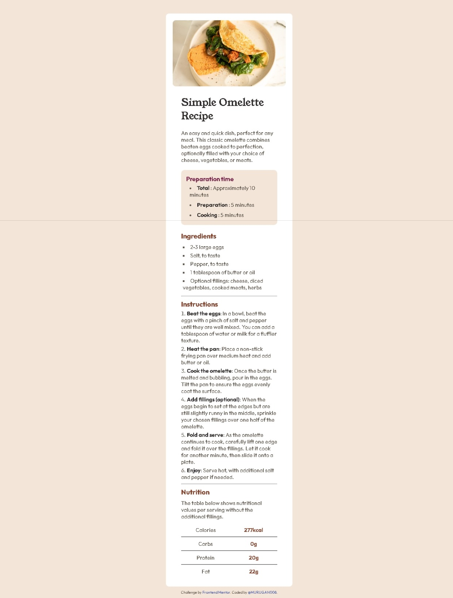
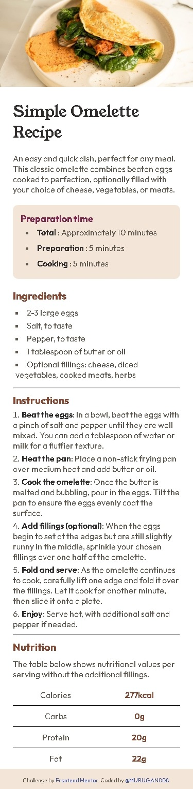

# Frontend Mentor - Recipe page solution

This is a solution to the [Recipe page challenge on Frontend Mentor](https://www.frontendmentor.io/challenges/recipe-page-KiTsR8QQKm). Frontend Mentor challenges help you improve your coding skills by building realistic projects. 

## Table of contents

- [Overview](#overview)
  - [Screenshot](#screenshot)
  - [Links](#links)
- [My process](#my-process)
  - [Built with](#built-with)
  - [What I learned](#what-i-learned)
- [Author](#author)


## Overview

 - I am create this webpage by using media query and flexbox to make it's responsive to all devices

### Screenshot

- Desktop View



- Mobile View




### Links

- Solution URL: [ Click here! ]()
- Live Site URL: [ Click here! ](https://murugan008.github.io/Recipe-Page/)

## My process

### Built with

- Semantic HTML5 markup
- CSS custom properties
- Flexbox
- Mobile-first workflow

### What I learned

In this css code i am made my webpage fit to the device which width is more than 375px (tablet, pc)

```css
@media (min-width: 376px) {
    body{
        display: flex;
        flex-flow: column;
        /* justify-content: start; */
        align-items: center;
        margin-top: 40px;
    }
    .container{
        /* width: 47.5rem; */
        padding: 20px;
        border-radius: 9px;
        img{
            border-radius: 9px;
        }
    }
    .container .nutrition{
    table{
        width: 100%;
    }
}

}
```

## Author

- Frontend Mentor - [@MURUGAN008](https://www.frontendmentor.io/profile/MURUGAN008)


